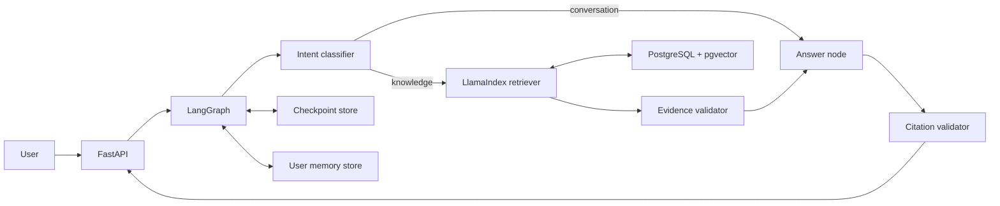

# Architecture

## Main flow



## Ingestion pipeline

`load → normalize → hash → parse → structure-aware chunk → enrich metadata → embed → upsert → deactivate obsolete chunks`.

Use two identifiers:

- `document_id`: stable logical document identity.
- `content_hash`: version identity used for deduplication.

## Graph state

```python
class AssistantState(TypedDict):
    tenant_id: str
    user_id: str
    thread_id: str
    question: str
    intent: str
    retrieved_chunks: list[dict]
    answer: dict | None
    validation_errors: list[str]
```

Do not put database clients, vector indexes, or secrets in graph state. State must remain serializable.

## Memory model

- Short-term: recent messages and compact conversation summary in the checkpoint.
- Semantic memory: verified user facts and preferences.
- Episodic memory: successful or failed task summaries, only when reusable.
- Procedural memory: application-owned rules stored in version control, not model-written memory.

Each long-term memory record includes source, confidence, created time, last confirmation time, and expiry policy.

## Key design decisions

- Retrieval and citation validation are deterministic nodes.
- The model cannot directly write arbitrary memory; it proposes a structured memory candidate.
- Start with dense retrieval, then add keyword retrieval and reranking only after measuring misses.
- Refusal is based on evidence coverage, not on a self-reported model confidence alone.

