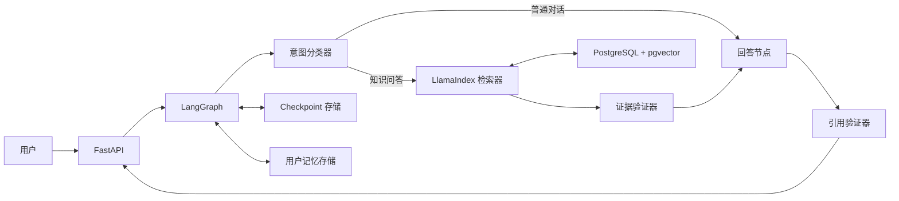

# 架构设计

## 主流程



## 导入流水线

`加载 → 规范化 → 计算哈希 → 解析 → 按结构切分 → 补充元数据 → Embedding → Upsert → 停用旧片段`。

使用两个标识符：

- `document_id`：稳定的逻辑文档标识。
- `content_hash`：用于去重的版本标识。

## 图状态

```python
class AssistantState(TypedDict):
    tenant_id: str
    user_id: str
    thread_id: str
    question: str
    intent: str
    retrieved_chunks: list[dict]
    answer: dict | None
    validation_errors: list[str]
```

数据库客户端、向量索引对象和密钥不得放入图状态。状态必须可序列化。

## 记忆模型

- 短期记忆：Checkpoint 中的近期消息和精简会话摘要。
- 语义记忆：经过验证的用户事实和偏好。
- 情景记忆：仅在可复用时保存成功或失败任务的摘要。
- 程序记忆：由应用维护并存放在版本控制中，不使用模型生成的记忆替代规则。

每条长期记忆包含来源、置信度、创建时间、最后确认时间和过期策略。

## 关键设计决策

- 检索和引用校验由确定性节点完成。
- 模型不能直接写入任意记忆，只能提出结构化的记忆候选项。
- 先建立稠密检索基线，只有在测量到实际遗漏后才增加关键词检索和 reranker。
- 是否拒答依据证据覆盖度，而不是只依赖模型自报置信度。

